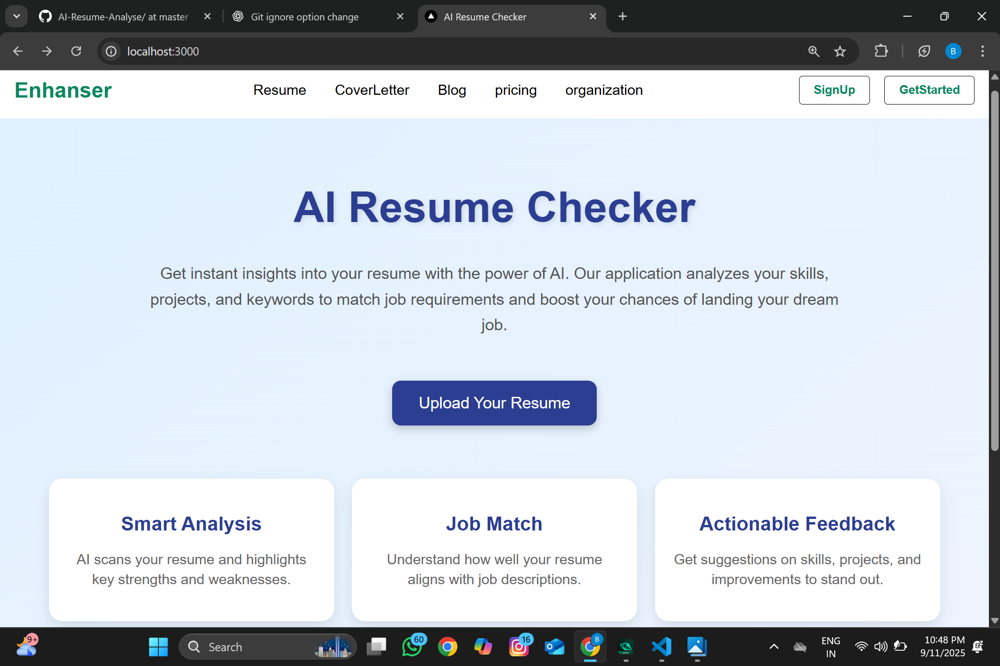
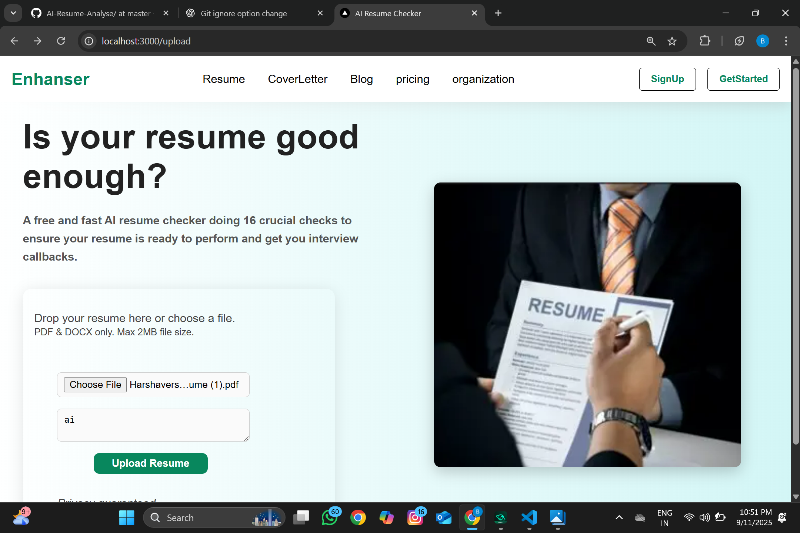
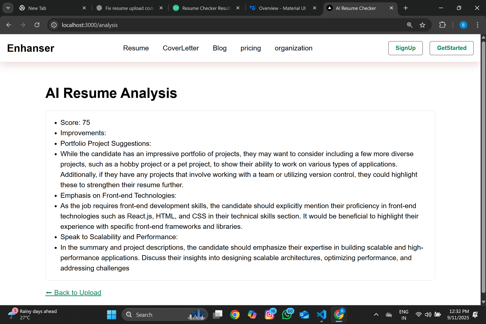
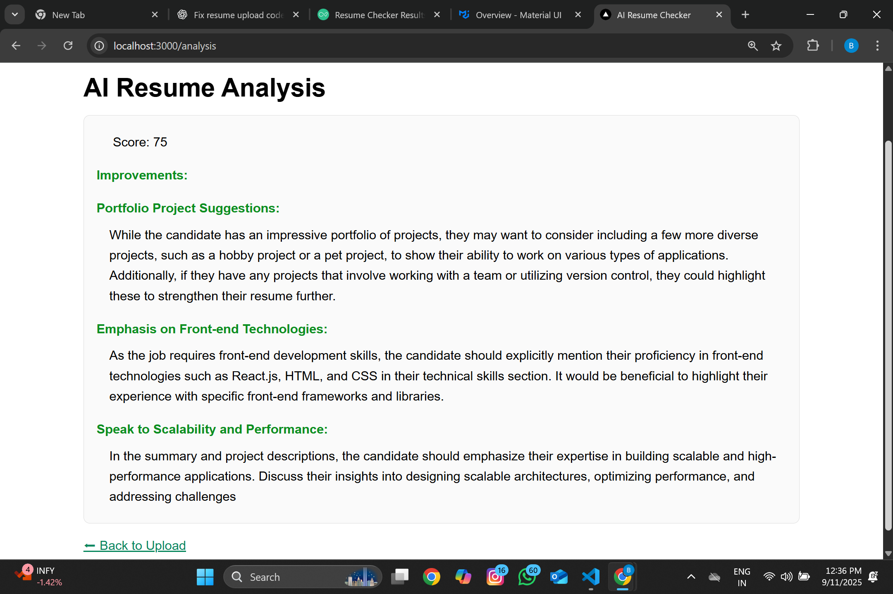

# 🌟 AI Resume Checker

[](https://nextjs.org/) 
[](https://nodejs.org/)
[](https://www.mongodb.com/)
[](https://cohere.ai/)

---

## 🚀 Project Overview

**AI Resume Checker** is a modern web application that analyzes your resume against real job descriptions using AI. It provides a **match score**, **detailed feedback**, and **improvement suggestions** to help you get more interview calls.  

---

## ✨ Features

- ✅ Upload **PDF or DOCX** resumes  
- ✅ Paste a **Job Description** for analysis  
- ✅ AI-generated **Match Score (0-100)**  
- ✅ Detailed **Improvement Suggestions**  
- ✅ Save and retrieve past analyses  
- ✅ **Fast and responsive UI** built with Next.js and React  
- ✅ Secure file handling  

---

## 🖼️ Screenshots / Demo

### Home Page

### Upload Page

### Analysis Page

### Upload Page

### Analysis Page

### Optional GIF Demo


---

## 🛠️ Tech Stack

| Frontend         | Backend          | AI / NLP             | Database      | Deployment        |
|-----------------|----------------|--------------------|---------------|-----------------|
| Next.js / React | Node.js / Express | Cohere AI          | MongoDB       | Render / Vercel |
| Tailwind CSS    | Multer (file upload) | PDF parsing with pdf-parse | Mongoose      |                 |

---

## 💻 Getting Started (Local Setup)

1. **Clone the repository**  
```bash
git clone https://github.com/Badrinathone-8/AI-Resume-Analyse.git
cd AI-Resume-Analyse
